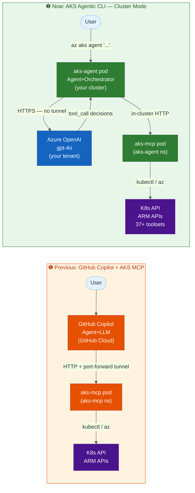
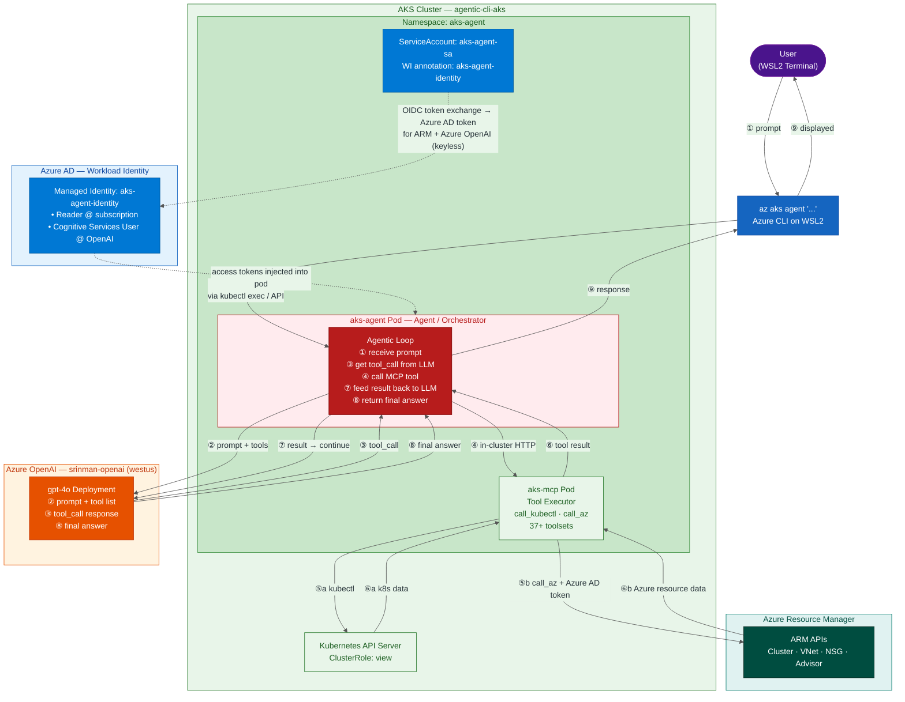

# AKS Agentic CLI — Cluster Mode with Workload Identity + Keyless Azure OpenAI

Step-by-step guide to deploy the AKS Agentic CLI in **cluster mode**, using Workload Identity for keyless authentication to both Azure resources and Azure OpenAI (`srinman-openai` / `gpt-4o`).

References:
- [Agentic CLI for AKS Overview](https://learn.microsoft.com/en-us/azure/aks/agentic-cli-for-aks-overview)
- [Install and Use Agentic CLI](https://learn.microsoft.com/en-us/azure/aks/agentic-cli-for-aks-install?pivots=cluster-mode)
- [Service Account + Workload Identity Setup](https://learn.microsoft.com/en-us/azure/aks/agentic-cli-for-aks-service-account-workload-identity-setup)

> **Prerequisite:** The `aks-mcp` remote server from [../aks-mcp/README.md](../aks-mcp/README.md) does not need to be running for this guide. The agentic CLI deploys its own `aks-mcp` pod inside the cluster.

---

## Why Agentic CLI Improves on GitHub Copilot + AKS MCP Server

The [previous demo](../aks-mcp/README.md) showed GitHub Copilot Chat using the AKS MCP server as a tool source. That setup works well but has key limitations. The agentic CLI for AKS addresses all of them:

| Capability | GitHub Copilot + AKS MCP | AKS Agentic CLI (Cluster Mode) |
|------------|--------------------------|-------------------------------|
| **Agent location** | Runs in GitHub cloud | Runs **inside your AKS cluster** — no port-forward needed |
| **LLM** | GitHub's model (you have no control) | **Your own Azure OpenAI** — data stays in your tenant |
| **Auth to Azure OpenAI** | n/a — GitHub manages it | Workload Identity — **no API keys stored anywhere** |
| **Tool depth** | General MCP tools (`call_az`, `call_kubectl`) | **37+ specialized AKS toolsets** including live metrics, Prometheus, node health, runbooks, log analysis |
| **Workflow** | VS Code Chat / Copilot CLI UI | `az aks agent` CLI — scriptable, CI/CD-friendly |
| **Multi-step reasoning** | Copilot decides (opaque) | Configurable `--max-steps` (default 40), visible tool trace |
| **Interactive shell** | No | `/shell` — drop into bash, share output with LLM |
| **Network dependency** | `kubectl port-forward` must stay open | None — agent pod talks directly to Kubernetes API in-cluster |
| **MCP server** | External pod + tunnel | Own `aks-mcp` pod deployed alongside agent in same namespace |
| **Conversation context** | Session-based | Persistent interactive mode with `/context`, `/clear` |

### Architecture comparison



**The key shift:** In the previous model the LLM lives in GitHub's cloud and the agent tunnel crosses your machine. In the agentic CLI model, **both the agent and the MCP server run inside your cluster**, and the LLM is **your own Azure OpenAI** resource — accessed keylessly via Workload Identity.

---

## Resource Details

| Item | Value |
|------|-------|
| Resource Group | `agentic-cli-aks-rg` |
| Cluster | `agentic-cli-aks` |
| Location | `westus` |
| Subscription | `3eef5dad-ad68-4246-8e02-e13d661de047` |
| Tenant | `d12058fe-ecf4-454a-9a69-cef5686fc24f` |
| Azure OpenAI Resource | `srinman-openai` (RG: `srinman-openai-rg`) |
| Azure OpenAI Endpoint | `https://srinman-openai.openai.azure.com/` |
| Model Deployment | `gpt-4o` (version `2024-11-20`) |
| Agent Namespace | `aks-agent` |
| Service Account | `aks-agent-sa` |
| Managed Identity | `aks-agent-identity` |

---

## Step 0: Set Variables

```bash
export RG="agentic-cli-aks-rg"
export CLUSTER="agentic-cli-aks"
export LOCATION="westus"
export SUBSCRIPTION=$(az account show --query "id" -o tsv)
export TENANT_ID=$(az account show --query "tenantId" -o tsv)

# Agent-specific
export AGENT_NAMESPACE="aks-agent"
export SERVICE_ACCOUNT_NAME="aks-agent-sa"
export IDENTITY_NAME="aks-agent-identity"
export FED_CRED_NAME="aks-agent-fed-cred"

# Azure OpenAI
export OPENAI_RG="srinman-openai-rg"
export OPENAI_NAME="srinman-openai"
export OPENAI_ENDPOINT="https://srinman-openai.openai.azure.com/"
export OPENAI_RESOURCE_ID=$(az cognitiveservices account show \
  --name $OPENAI_NAME \
  --resource-group $OPENAI_RG \
  --query "id" -o tsv)

az aks get-credentials \
  --resource-group $RG \
  --name $CLUSTER \
  --overwrite-existing
```

---

## Step 1: Install the `aks-agent` Azure CLI Extension

```bash
# Install (takes 5-10 minutes on first run)
az extension add --name aks-agent

# If already installed, update it
az extension update --name aks-agent

# Verify
az aks agent --help
```

---

## Step 2: Create the Agent Namespace and Service Account

```bash
# Create namespace
kubectl create namespace $AGENT_NAMESPACE

# Create service account
kubectl create serviceaccount $SERVICE_ACCOUNT_NAME \
  --namespace $AGENT_NAMESPACE
```

---

## Step 3: Grant Kubernetes RBAC Permissions (Cluster-wide read)

The built-in `view` ClusterRole covers namespace-scoped resources but **excludes cluster-scoped resources** such as `nodes`. The agentic CLI needs to list nodes for health and capacity queries, so a supplemental ClusterRole is required.

Apply both in one manifest:

```bash
cat <<EOF | kubectl apply -f -
apiVersion: rbac.authorization.k8s.io/v1
kind: ClusterRoleBinding
metadata:
  name: aks-agent-view-rolebinding
roleRef:
  apiGroup: rbac.authorization.k8s.io
  kind: ClusterRole
  name: view
subjects:
- kind: ServiceAccount
  name: ${SERVICE_ACCOUNT_NAME}
  namespace: ${AGENT_NAMESPACE}
---
apiVersion: rbac.authorization.k8s.io/v1
kind: ClusterRole
metadata:
  name: aks-agent-node-reader
rules:
- apiGroups: [""]
  resources: ["nodes", "nodes/status", "nodes/metrics", "nodes/proxy", "persistentvolumes"]
  verbs: ["get", "list", "watch"]
- apiGroups: ["metrics.k8s.io"]
  resources: ["nodes", "pods"]
  verbs: ["get", "list", "watch"]
- apiGroups: ["storage.k8s.io"]
  resources: ["storageclasses", "volumeattachments"]
  verbs: ["get", "list", "watch"]
---
apiVersion: rbac.authorization.k8s.io/v1
kind: ClusterRoleBinding
metadata:
  name: aks-agent-node-reader-rolebinding
roleRef:
  apiGroup: rbac.authorization.k8s.io
  kind: ClusterRole
  name: aks-agent-node-reader
subjects:
- kind: ServiceAccount
  name: ${SERVICE_ACCOUNT_NAME}
  namespace: ${AGENT_NAMESPACE}
EOF

# Verify
kubectl get clusterrolebinding aks-agent-view-rolebinding aks-agent-node-reader-rolebinding
kubectl get clusterrole aks-agent-node-reader
kubectl auth can-i list nodes \
  --as=system:serviceaccount:${AGENT_NAMESPACE}:${SERVICE_ACCOUNT_NAME}
# Expected: yes
```

---

## Step 4: Create Managed Identity

The agent needs a managed identity for two things:
1. **Azure ARM API calls** — reading cluster config, VNets, NSGs, Advisor (`Reader` role)
2. **Azure OpenAI calls** — keyless token auth (`Cognitive Services User` role)

```bash
# Create managed identity
az identity create \
  --resource-group $RG \
  --name $IDENTITY_NAME \
  --location $LOCATION

# Retrieve IDs
export IDENTITY_CLIENT_ID=$(az identity show \
  --resource-group $RG \
  --name $IDENTITY_NAME \
  --query "clientId" -o tsv)

export IDENTITY_PRINCIPAL_ID=$(az identity show \
  --resource-group $RG \
  --name $IDENTITY_NAME \
  --query "principalId" -o tsv)

echo "Client ID:    $IDENTITY_CLIENT_ID"
echo "Principal ID: $IDENTITY_PRINCIPAL_ID"
```

---

## Step 5: Assign Azure RBAC Roles to the Managed Identity

### 5a: Reader at subscription scope (for ARM/AKS resource queries)

```bash
az role assignment create \
  --role "Reader" \
  --assignee-object-id $IDENTITY_PRINCIPAL_ID \
  --assignee-principal-type ServicePrincipal \
  --scope "/subscriptions/$SUBSCRIPTION"
```

### 5b: Cognitive Services User on the Azure OpenAI resource (keyless auth)

This is what enables the agent pod to call Azure OpenAI **without an API key** — the Workload Identity token is exchanged for an Azure AD access token, which is then presented to the OpenAI endpoint.

```bash
az role assignment create \
  --role "Cognitive Services User" \
  --assignee-object-id $IDENTITY_PRINCIPAL_ID \
  --assignee-principal-type ServicePrincipal \
  --scope "$OPENAI_RESOURCE_ID"
```

Verify both assignments:

```bash
az role assignment list \
  --assignee $IDENTITY_CLIENT_ID \
  --query "[].{role:roleDefinitionName, scope:scope}" -o table
```

---

## Step 6: Create Federated Identity Credential

Links the Kubernetes ServiceAccount → managed identity via OIDC. Must be created **before** `az aks agent-init`.

```bash
export AKS_OIDC_ISSUER=$(az aks show \
  --resource-group $RG \
  --name $CLUSTER \
  --query "oidcIssuerProfile.issuerUrl" -o tsv)

echo "OIDC Issuer: $AKS_OIDC_ISSUER"

az identity federated-credential create \
  --name $FED_CRED_NAME \
  --identity-name $IDENTITY_NAME \
  --resource-group $RG \
  --issuer $AKS_OIDC_ISSUER \
  --subject "system:serviceaccount:${AGENT_NAMESPACE}:${SERVICE_ACCOUNT_NAME}" \
  --audience api://AzureADTokenExchange
```

---

## Step 7: Annotate the Service Account for Workload Identity

The Workload Identity webhook reads this annotation to inject the projected token into pods that use this ServiceAccount.

```bash
kubectl annotate serviceaccount $SERVICE_ACCOUNT_NAME \
  --namespace $AGENT_NAMESPACE \
  azure.workload.identity/client-id="$IDENTITY_CLIENT_ID" \
  --overwrite

# Verify annotation
kubectl describe serviceaccount $SERVICE_ACCOUNT_NAME -n $AGENT_NAMESPACE
```

---

## Step 8: Run `az aks agent-init` — Cluster Mode

This interactive command deploys both `aks-agent` and `aks-mcp` pods into the cluster via Helm.

```bash
az aks agent-init \
  --resource-group $RG \
  --name $CLUSTER
```

When prompted, answer as follows:

```
Enter your choice (1 or 2): 1                        ← Cluster mode

Enter namespace: aks-agent                            ← your AGENT_NAMESPACE

Please choose the LLM provider (1-5):                ← Azure OpenAI

  1. Azure OpenAI (API Key)
  2. Azure OpenAI (Microsoft Entra ID)               ← choose 2 for keyless

Enter the number: 2

Enter value for MODEL_NAME: gpt-4o
Enter value for AZURE_API_BASE: https://srinman-openai.openai.azure.com/
Enter value for AZURE_API_VERSION: 2025-04-01-preview

Enter service account name: aks-agent-sa             ← your SERVICE_ACCOUNT_NAME
```

Wait for deployment (< 2 minutes):

```
🚀 Deploying AKS agent...
✅ AKS agent deployed successfully!
✅ AKS agent is ready and running!
```

---

## Step 9: Verify the Deployment

```bash
# Check both pods are running
kubectl get pods -n $AGENT_NAMESPACE

# Check deployments
kubectl get deployment -n $AGENT_NAMESPACE

# Check agent status via CLI
az aks agent \
  --status \
  --resource-group $RG \
  --name $CLUSTER \
  --namespace $AGENT_NAMESPACE
```

Expected output:

```
✅ Helm Release: deployed

📦 Deployments:
  • aks-agent: 1/1 ready
  • aks-mcp:   1/1 ready

🐳 Pods:
  • aks-agent-xxxxx: Running ✓
  • aks-mcp-xxxxx:   Running ✓

📋 LLM Configurations:
  • azure/gpt-4o
    API Base: https://srinman-openai.openai.azure.com/
    API Version: 2025-04-01-preview

✅ AKS agent is ready and running!
```

---

## Step 10: Use the Agentic CLI

No port-forward needed. The agent pod talks directly to the Kubernetes API and the `aks-mcp` pod in-cluster.

### Basic queries (non-interactive)

```bash
az aks agent "How many nodes are in my cluster?" \
  --resource-group $RG \
  --name $CLUSTER \
  --namespace $AGENT_NAMESPACE \
  --model=azure/gpt-4o \
  --no-interactive

az aks agent "Why are any pods pending or crashlooping?" \
  --resource-group $RG \
  --name $CLUSTER \
  --namespace $AGENT_NAMESPACE \
  --model=azure/gpt-4o \
  --no-interactive \
  --show-tool-output

az aks agent "What is the network configuration (VNet, subnet, NSG) for this cluster?" \
  --resource-group $RG \
  --name $CLUSTER \
  --namespace $AGENT_NAMESPACE \
  --model=azure/gpt-4o \
  --no-interactive
```

### Interactive session (recommended for exploration)

```bash
az aks agent "Investigate the overall health of this cluster" \
  --resource-group $RG \
  --name $CLUSTER \
  --namespace $AGENT_NAMESPACE \
  --model=azure/gpt-4o
```

Inside the interactive session, use these commands:

| Command | Purpose |
|---------|---------|
| `/tools` | Show all 37+ toolsets and their status |
| `/last` | Show all tool outputs from the last response |
| `/show` | Scroll through a specific tool output |
| `/run <cmd>` | Run a bash command and optionally share with LLM |
| `/shell` | Drop into interactive bash, then share session with LLM |
| `/context` | Show conversation token count |
| `/clear` | Reset conversation context |
| `/exit` | Leave interactive mode |

---

## How It Works — Full Agentic Flow



**Key difference from the GitHub Copilot flow:** The LLM (`gpt-4o`) is **your own Azure OpenAI resource**. The agent pod authenticates to it using the **same Workload Identity** used for ARM calls — no API key stored anywhere. All traffic stays within your Azure tenant.

---

## Cleanup

```bash
# Remove the agentic CLI deployment
az aks agent-cleanup \
  --resource-group $RG \
  --name $CLUSTER \
  --namespace $AGENT_NAMESPACE

# Verify pods are gone
kubectl get pods -n $AGENT_NAMESPACE

# Remove Azure resources
az identity federated-credential delete \
  --name $FED_CRED_NAME \
  --identity-name $IDENTITY_NAME \
  --resource-group $RG

az role assignment delete \
  --assignee $IDENTITY_PRINCIPAL_ID \
  --scope "/subscriptions/$SUBSCRIPTION"

az role assignment delete \
  --assignee $IDENTITY_PRINCIPAL_ID \
  --scope "$OPENAI_RESOURCE_ID"

az identity delete \
  --resource-group $RG \
  --name $IDENTITY_NAME

# Remove RBAC
kubectl delete clusterrolebinding aks-agent-view-rolebinding aks-agent-node-reader-rolebinding
kubectl delete clusterrole aks-agent-node-reader
kubectl delete namespace $AGENT_NAMESPACE

# Remove the CLI extension (optional)
az extension remove --name aks-agent
```

---

## Troubleshooting

| Issue | Likely Cause | Fix |
|-------|-------------|-----|
| `az aks agent-init` fails at Helm deploy | Service account doesn't exist or WI not annotated | Re-check Steps 2 and 7 |
| Agent pod `CrashLoopBackOff` | Federated credential mismatch | Verify `--subject` matches `system:serviceaccount:aks-agent:aks-agent-sa` |
| `AuthenticationFailed` on Azure OpenAI | Missing `Cognitive Services User` role | Re-run Step 5b |
| `Unauthorized` on ARM calls | Missing `Reader` role | Re-run Step 5a |
| `aks-mcp` pod not starting | WI webhook not injecting token | Check pod annotations: `kubectl describe pod -l app.kubernetes.io/name=aks-mcp -n aks-agent` |
| `nodes is forbidden ... cannot list resource "nodes"` | `view` ClusterRole excludes cluster-scoped `nodes` resource | Apply `aks-agent-node-reader` ClusterRole from Step 3 |

### Check Workload Identity on agent pod

```bash
kubectl describe pod -l app.kubernetes.io/name=aks-agent -n $AGENT_NAMESPACE \
  | grep -A5 "azure.workload.identity"
```

### Check role assignments

```bash
az role assignment list \
  --assignee $IDENTITY_CLIENT_ID \
  --query "[].{role:roleDefinitionName, scope:scope}" -o table
```
