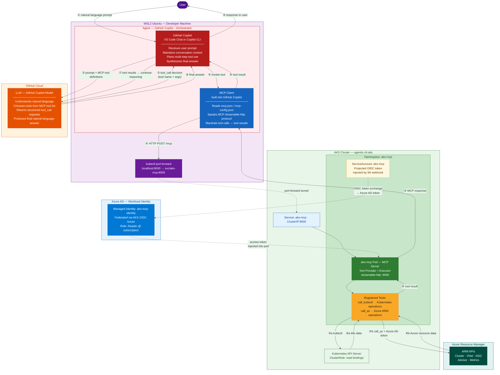

# AKS MCP Server — Remote Mode with Workload Identity

Step-by-step guide to deploy the AKS Model Context Protocol (MCP) server in remote mode using Workload Identity, test via port-forwarding, and connect GitHub Copilot Chat in VS Code (WSL2).

Reference: [AKS MCP Server Documentation](https://learn.microsoft.com/en-us/azure/aks/aks-model-context-protocol-server?tabs=vscode%2Cworkload-identity%2Cuninstall-remote)

---

## Architecture Overview — Agentic Flow



### Agentic loop explained

The **agentic loop** is the repeating cycle the agent runs until the task is complete:

```
① User          → Agent:       natural language prompt
② Agent         → LLM:         prompt + list of available MCP tools
③ LLM           → Agent:       tool_call decision  (tool name + args)
④ Agent/MCP Client → MCP Server:  HTTP POST /mcp  (via port-forward tunnel)
⑤a MCP Server  → K8s API:     call_kubectl (pod list, events, logs…)
⑤b MCP Server  → ARM APIs:    call_az (cluster info, VNet, NSG, Advisor…)
⑥  MCP Server  → Agent:       tool result returned
⑦  Agent        → LLM:         "here is the tool result — continue reasoning"
   ↑_______ repeats ③–⑦ until LLM has enough information _______↑
⑧  LLM          → Agent:       final natural language answer
⑨  Agent        → User:        response displayed in chat
```

### Role of each component

| Component | Role | Identity |
|-----------|------|----------|
| **GitHub Copilot** (VS Code / CLI) | **Agent / Orchestrator** — drives the loop, decides when done | Your user session |
| **GitHub Copilot Model (LLM)** | **Reasoning engine** — understands intent, selects tools, synthesizes answer | GitHub cloud (no local identity) |
| **MCP Client** (built into Copilot) | **Tool call transport** — speaks MCP protocol, routes calls to the server | Inherits agent session |
| **kubectl port-forward** | **Network tunnel** — bridges WSL2 localhost to the in-cluster service | Your kubeconfig context |
| **aks-mcp Pod (MCP Server)** | **Tool executor** — implements `call_kubectl` and `call_az` tools | ServiceAccount (K8s) + Managed Identity (Azure) |
| **Managed Identity** | **Azure credential** — passwordless auth for ARM calls via Workload Identity | Federated via AKS OIDC issuer |

**Solid arrows** = request/response data flow &nbsp;|&nbsp; **Dotted arrows** = identity/token injection

---

## Prerequisites

- Azure CLI installed and logged in (`az login`)
- `kubectl` installed
- `helm` v3.8+
- WSL2 Ubuntu on Windows
- VS Code with GitHub Copilot extension (for testing)

---

## Option A — Use an Existing Cluster

This guide uses:
- **Resource Group:** `agentic-cli-aks-rg`
- **Cluster:** `agentic-cli-aks`
- **Location:** `westus`
- **Subscription:** `3eef5dad-ad68-4246-8e02-e13d661de047`

The cluster already has OIDC issuer and Workload Identity enabled. Skip to [Step 2](#step-2-create-a-managed-identity-and-assign-rbac).

---

## Option B — Create a Brand New Cluster

### Step 0a: Set Variables

```bash
export RG="aks-mcp-demo-rg"
export CLUSTER="aks-mcp-demo"
export LOCATION="westus"
export SUBSCRIPTION=$(az account show --query "id" -o tsv)
```

### Step 0b: Create Resource Group

```bash
az group create \
  --name $RG \
  --location $LOCATION
```

### Step 0c: Create AKS Cluster with OIDC + Workload Identity

```bash
az aks create \
  --resource-group $RG \
  --name $CLUSTER \
  --location $LOCATION \
  --node-count 2 \
  --enable-oidc-issuer \
  --enable-workload-identity \
  --generate-ssh-keys
```

> This creates a cluster with OIDC issuer and Workload Identity enabled from the start. Skip Step 1 below.

### Step 0d: Get Credentials

```bash
az aks get-credentials \
  --resource-group $RG \
  --name $CLUSTER \
  --overwrite-existing
```

---

## Existing Cluster Path — Variables

Set these variables for the existing cluster:

```bash
export RG="agentic-cli-aks-rg"
export CLUSTER="agentic-cli-aks"
export LOCATION="westus"
export SUBSCRIPTION=$(az account show --query "id" -o tsv)
```

---

## Step 1: Enable OIDC Issuer and Workload Identity (existing cluster only)

> **Skip this step** if your cluster already has OIDC and Workload Identity enabled.
> The `agentic-cli-aks` cluster already has both enabled — confirmed via `az aks show`.

```bash
az aks update \
  --resource-group $RG \
  --name $CLUSTER \
  --enable-oidc-issuer \
  --enable-workload-identity
```

---

## Step 2: Create a Managed Identity and Assign RBAC

```bash
# Create the managed identity
az identity create \
  --resource-group $RG \
  --name aks-mcp-identity \
  --location $LOCATION

# Retrieve identity IDs
export IDENTITY_CLIENT_ID=$(az identity show \
  --resource-group $RG \
  --name aks-mcp-identity \
  --query "clientId" -o tsv)

export IDENTITY_PRINCIPAL_ID=$(az identity show \
  --resource-group $RG \
  --name aks-mcp-identity \
  --query "principalId" -o tsv)

echo "Client ID: $IDENTITY_CLIENT_ID"
echo "Principal ID: $IDENTITY_PRINCIPAL_ID"

# Assign Reader role at subscription scope
# Use Contributor instead of Reader for readwrite access
az role assignment create \
  --role "Reader" \
  --assignee-object-id $IDENTITY_PRINCIPAL_ID \
  --assignee-principal-type ServicePrincipal \
  --scope "/subscriptions/$SUBSCRIPTION"
```

> **Why this role assignment?**
>
> The managed identity (`aks-mcp-identity`) is what the MCP server pod authenticates as when making **Azure Resource Manager (ARM) API calls**. The flow is:
>
> 1. The Helm chart creates a Kubernetes `ServiceAccount` (`aks-mcp`) in namespace `aks-mcp`
> 2. The federated credential (Step 3) links that ServiceAccount → this managed identity via OIDC
> 3. When the pod starts, the Workload Identity webhook injects a projected token into the pod
> 4. The MCP server exchanges that token for an **Azure AD access token** scoped to this managed identity
> 5. That token is used for all `call_az` tool calls — querying cluster config, VNets/NSGs, node pools, Azure Advisor, metrics, etc.
>
> `Reader` at subscription scope allows the MCP server to **read any Azure resource** in the subscription without making changes.
> Upgrade to `Contributor` (and set `--access-level readwrite` in the Helm chart) only when you need the MCP server to perform write operations on Azure resources.
>
> **Note:** Kubernetes RBAC (kubectl operations) is separate — the Helm chart creates its own `ClusterRole` bindings for the ServiceAccount inside the cluster.

---

## Step 3: Create Federated Identity Credential

> **Important:** Create this BEFORE installing the Helm chart.

```bash
# Get OIDC issuer URL
export AKS_OIDC_ISSUER=$(az aks show \
  --resource-group $RG \
  --name $CLUSTER \
  --query "oidcIssuerProfile.issuerUrl" -o tsv)

echo "OIDC Issuer: $AKS_OIDC_ISSUER"

# Create federated credential
# The subject maps to: system:serviceaccount:<namespace>:<serviceaccount-name>
# Helm chart deploys into namespace "aks-mcp" with SA name "aks-mcp"
az identity federated-credential create \
  --name "aks-mcp-federated-credential" \
  --identity-name aks-mcp-identity \
  --resource-group $RG \
  --issuer $AKS_OIDC_ISSUER \
  --subject "system:serviceaccount:aks-mcp:aks-mcp" \
  --audience api://AzureADTokenExchange
```

---

## Step 4: Get Cluster Credentials

```bash
az aks get-credentials \
  --resource-group $RG \
  --name $CLUSTER \
  --overwrite-existing

kubectl get nodes
```

---

## Step 5: Clone the AKS MCP Repository

Clone into `~/git` to avoid nesting a git repo inside another git repo:

```bash
cd ~/git
git clone https://github.com/Azure/aks-mcp.git
cd ~/git/aks-mcp/chart
```

---

## Step 6: Install the Helm Chart with Workload Identity

`azure.tenantId` is required when `workloadIdentity.enabled=true`. Capture it first:

```bash
export TENANT_ID=$(az account show --query "tenantId" -o tsv)
echo "Tenant ID: $TENANT_ID"
```

```bash
helm install aks-mcp . \
  --namespace aks-mcp \
  --create-namespace \
  --set workloadIdentity.enabled=true \
  --set azure.clientId=$IDENTITY_CLIENT_ID \
  --set azure.subscriptionId=$SUBSCRIPTION \
  --set azure.tenantId=$TENANT_ID
```

### Verify the deployment

```bash
# Check pods are running
kubectl get pods -n aks-mcp

# Check the service
kubectl get svc -n aks-mcp

# Inspect pod logs
kubectl logs -l app.kubernetes.io/name=aks-mcp -n aks-mcp --tail=50
```

Expected: one pod in `Running` state with the workload identity annotation injected.

---

## Step 7: Port-Forward for Local Testing

Open a dedicated terminal and run:

```bash
kubectl port-forward svc/aks-mcp 8000:8000 -n aks-mcp
```

Keep this terminal open. The MCP server is now reachable at `http://localhost:8000`.

Verify it's responding:

```bash
curl -s http://localhost:8000/health 2>/dev/null || \
  curl -s http://localhost:8000/ | head -20
```

Expected output:

```json
{"oauth":{"enabled":false},"status":"healthy","transport":"streamable-http","version":"0.0.17+1775182130"}
```

| Field | Expected Value | Meaning |
|-------|---------------|---------|
| `status` | `healthy` | Server is up and running |
| `transport` | `streamable-http` | Correct transport for remote mode |
| `oauth.enabled` | `false` | Expected — using Workload Identity, not OAuth |
| `version` | `0.0.17` | Current build version |

---

## Step 8: Configure GitHub Copilot (VS Code) — WSL2

The MCP server config file location depends on whether VS Code is running **on Windows** connecting to WSL, or running **inside WSL** via Remote-WSL.

### Option 1: VS Code Workspace Config (recommended)

Create or edit `.vscode/mcp.json` in your workspace root:

```bash
cd ~/git/platform-engineering
mkdir -p .vscode
cat > .vscode/mcp.json << 'EOF'
{
  "servers": {
    "aks-mcp": {
      "url": "http://localhost:8000/mcp",
      "type": "http"
    }
  }
}
EOF

```

### Option 2: VS Code User Settings

Open VS Code settings (`Ctrl+Shift+P` → `Open User Settings (JSON)`) and add:

```json
"mcp": {
  "servers": {
    "aks-mcp": {
      "url": "http://localhost:8000/mcp",
      "type": "http"
    }
  }
}
```

> **WSL2 Note:** Because VS Code Remote-WSL runs the VS Code server inside WSL, `localhost:8000` in the MCP config resolves to the WSL2 `localhost` — which is where the port-forward is running. This works as-is.
> If you're running VS Code on Windows (not Remote-WSL), use `127.0.0.1:8000` instead; Windows and WSL2 share the loopback on modern Windows 11 builds.

---

## Step 9: Check for Duplicate AKS MCP Servers and Disable the Local One

Before using the remote MCP server, check whether a **local** AKS MCP server is also registered (commonly auto-added by the AKS VS Code extension). Running both simultaneously causes duplicate tool calls and unpredictable results.

### MCP config file locations

There are **three** places to check — all three must point to the remote http server, not a local stdio entry:

**1. Copilot CLI user config (WSL2) — `~/.copilot/mcp-config.json`**

This is the config read by the Copilot CLI when running inside WSL2:

```bash
cat ~/.copilot/mcp-config.json
```

Check: `aks-mcp` entry must be `"type": "http"`, not `"type": "stdio"`. If it shows `wsl.exe` or a local binary path, fix it:

```bash
python3 -c "
import json

with open('/home/$USER/.copilot/mcp-config.json', 'r') as f:
    config = json.load(f)

config['mcpServers'].pop('aks-mcp', None)
config['mcpServers']['aks-mcp'] = {
    'type': 'http',
    'url': 'http://localhost:8000/mcp'
}

with open('/home/$USER/.copilot/mcp-config.json', 'w') as f:
    json.dump(config, f, indent=2)
print('Done')
"
```

Verify:

```bash
~/.vscode-server/data/User/globalStorage/github.copilot-chat/copilotCli/copilot mcp list
# Expected: aks-mcp (http)
```

---

**2. VS Code global `mcp.json` (Windows side — auto-managed by the AKS VS Code extension)**

```bash
cat /mnt/c/Users/<your-windows-username>/AppData/Roaming/Code/User/mcp.json
```

The AKS extension auto-registers a local `AKS MCP` stdio server here. Remove that block, leaving any other servers (e.g. `github-mcp-server`) intact:

```bash
nano /mnt/c/Users/smanivel/AppData/Roaming/Code/User/mcp.json
```

---

**3. VS Code workspace-level `mcp.json` (the remote server configured in Step 8)**

```bash
cat ~/git/platform-engineering/.vscode/mcp.json
```

This should already be correct — `"type": "http"` pointing to `http://localhost:8000/mcp`.

---

> **Goal:** All three config sources must show `aks-mcp` as `"type": "http"` pointing to `http://localhost:8000/mcp`. No `stdio` / `wsl.exe` entries for AKS MCP should remain.

---

## Step 10: Verify the Remote MCP Server is Connected in Copilot Chat

For a remote MCP server (streamable-http transport), VS Code connects to the URL automatically — there is no server process to "start". VS Code Copilot reads `mcp.json` and connects on demand.

1. Reload the VS Code window: `Ctrl+Shift+P` → **Developer: Reload Window**
2. Open **Copilot Chat** (sidebar)
3. Click the **Tools** icon in the chat toolbar — confirm only one `MCP Server: aks-mcp` entry is listed, with `streamable-http` transport

> **Note:** If you don't see the tools, open the Command Palette → **MCP: List Servers** to check connection status and any error messages.

---

## Step 11: Test with GitHub Copilot Chat

With the port-forward running and MCP server active, try these prompts in Copilot Chat:

```
Why are any pods pending in cluster agentic-cli-aks?
```

```
What is the node pool configuration of agentic-cli-aks?
```

```
List all namespaces and their resource quotas in agentic-cli-aks.
```

```
What is the network configuration (VNet, subnet, NSG) for agentic-cli-aks?
```

```
Are there any unhealthy workloads in the agentic-cli-aks cluster?
```

The MCP server uses the Workload Identity (managed identity) to authenticate Azure API calls, and the pod's ServiceAccount for Kubernetes API calls.

---

## Step 12: Validate All Traffic Routes Through Port-Forward

To confirm the Copilot CLI is actually using the remote MCP server (not a local binary), cancel the port-forward and verify that MCP tool calls fail.

**1. Stop the port-forward** (Ctrl+C in the terminal running it):

```bash
# In the port-forward terminal, press Ctrl+C
# Confirm it's stopped:
curl -s http://localhost:8000/health
# Expected: connection refused — nothing listening on 8000
```

**2. Run a Copilot CLI query that requires the MCP server:**

```bash
~/.vscode-server/data/User/globalStorage/github.copilot-chat/copilotCli/copilot \
  chat "list pods in aks-mcp namespace" 2>&1
```

Expected: the tool call fails or times out with a connection error to `localhost:8000` — confirming the Copilot CLI is not falling back to any local binary.

**3. Restart the port-forward and confirm recovery:**

```bash
kubectl port-forward svc/aks-mcp 8000:8000 -n aks-mcp
```

Re-run the same query — it should succeed again, proving all MCP traffic flows through the port-forward tunnel to the remote pod.

> This validates the architecture diagram: without the tunnel, the MCP server is unreachable regardless of what config files are present.

---

## Cleanup

```bash
# Remove Helm release
helm uninstall aks-mcp --namespace aks-mcp

# Delete namespace
kubectl delete namespace aks-mcp

# Delete federated credential
az identity federated-credential delete \
  --name "aks-mcp-federated-credential" \
  --identity-name aks-mcp-identity \
  --resource-group $RG

# Remove role assignment
az role assignment delete \
  --assignee $IDENTITY_PRINCIPAL_ID \
  --scope "/subscriptions/$SUBSCRIPTION"

# Delete managed identity
az identity delete \
  --resource-group $RG \
  --name aks-mcp-identity
```

---

## Troubleshooting

| Issue | Likely Cause | Fix |
|-------|-------------|-----|
| Pod in `CrashLoopBackOff` | Federated credential mismatch | Verify `--subject` matches `system:serviceaccount:aks-mcp:aks-mcp` |
| `call_az` returns auth errors | Managed identity not federated or missing RBAC | Re-check Steps 2 and 3 |
| Port-forward disconnects | kubectl timeout | Re-run `kubectl port-forward` command |
| MCP server not visible in Copilot | Wrong mcp.json path or format | Confirm file is saved; reload VS Code window (`Ctrl+Shift+P` → Reload Window) |
| `curl` returns 404 | Server uses `/mcp` path | Try `http://localhost:8000/mcp` |

### Check Workload Identity injection

```bash
kubectl describe pod -l app.kubernetes.io/name=aks-mcp -n aks-mcp | grep -A5 "azure.workload.identity"
```

You should see the `azure.workload.identity/client-id` annotation and projected volume for the token.

### Check Azure RBAC assignment

```bash
az role assignment list \
  --assignee $IDENTITY_CLIENT_ID \
  --scope "/subscriptions/$SUBSCRIPTION" \
  --query "[].{role:roleDefinitionName, scope:scope}" -o table
```
