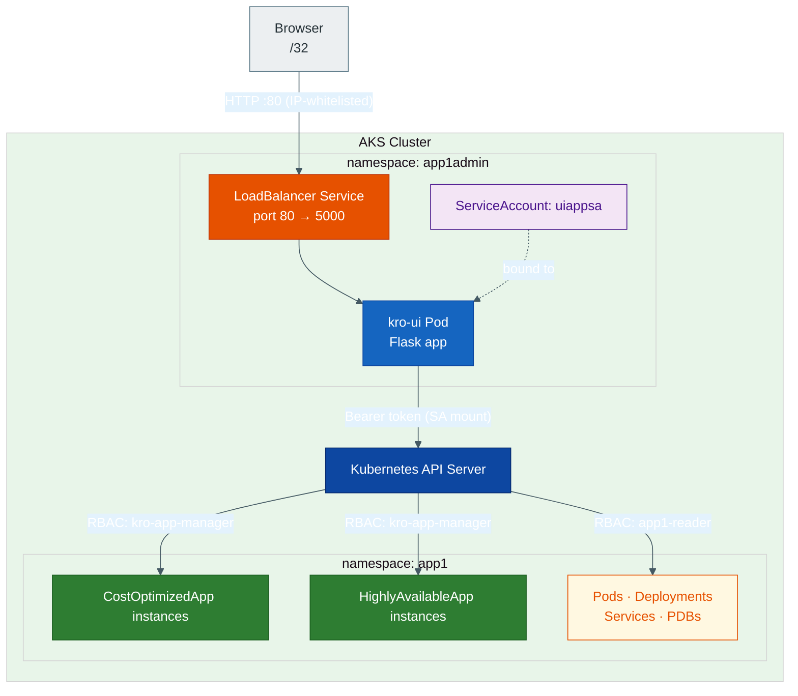

# kro Platform UI

A lightweight Flask web application that runs in the `app1admin` namespace and lets you manage `CostOptimizedApp` and `HighlyAvailableApp` kro instances in the `app1` namespace. It also provides read-only views of Pods, Deployments, Services, and PodDisruptionBudgets in `app1`.

## Architecture



## Directory Structure

```
ui-app/
├── Dockerfile
├── k8s/
│   ├── 01-namespaces.yaml      # app1admin + app1 namespaces
│   ├── 02-serviceaccount.yaml  # uiappsa in app1admin
│   ├── 03-rbac.yaml            # Roles + RoleBindings (cross-namespace)
│   ├── 04-deployment.yaml      # kro-ui Deployment (app1admin)
│   └── 05-service.yaml         # LoadBalancer, IP-restricted to <YOUR_EGRESS_IP>/32
└── app/
    ├── app.py                  # Flask backend — talks to K8s API server-side
    ├── requirements.txt
    └── templates/
        └── index.html          # Bootstrap 5 SPA with tab-based navigation
```

## RBAC Summary

| Role | Namespace | Resources | Verbs |
|------|-----------|-----------|-------|
| `kro-app-manager` | `app1` | `costoptimizedapps`, `highlyavailableapps` (kro.run) | get, list, watch, create, update, patch, delete |
| `app1-reader` | `app1` | pods, services, endpoints, events, deployments, replicasets, statefulsets, daemonsets (+ policy/pdbs, autoscaling/hpa) | get, list, watch |

Both roles are bound to `uiappsa` (in `app1admin`) via cross-namespace `RoleBinding` objects placed in `app1`.

## Build and Deploy

### 1. Prerequisites

This walkthrough picks up directly after completing the steps in [index.md](../index.md). At that point you already have:

- A zonal AKS cluster running in `westus2` with credentials downloaded
- `kro` installed in `kro-system`
- Both `ResourceGraphDefinition` objects (`cost-optimized-app` and `highly-available-app`) registered and `Active`

Re-export the environment variables that were set in `index.md` plus add the ACR name:

```bash
export RESOURCE_GROUP="rg-kro-simple-demo"
export CLUSTER_NAME="aks-kro-simple-demo"
export LOCATION="westus2"
export ACR_NAME="srinmantest"
export IMAGE="${ACR_NAME}.azurecr.io/kro-ui:latest"
```

Confirm the cluster context is correct and both RGDs are active before continuing:

```bash
kubectl config current-context

kubectl get rgd cost-optimized-app highly-available-app
# Both should show STATE=Active and READY=True
```

### 2. Build the image with ACR

`az acr build` sends the build context to ACR and builds server-side — no local Docker daemon required.

```bash
# Navigate to the ui-app directory (from the repo root)
cd kro/kroapp/ui-app

az acr build \
  --registry "$ACR_NAME" \
  --image kro-ui:latest \
  .
```

Verify the image was pushed:

```bash
az acr repository show-tags \
  --name "$ACR_NAME" \
  --repository kro-ui \
  --output table
```

### 3. Attach ACR to AKS

This lets the cluster pull images from ACR without separate image pull secrets:

```bash
az aks update \
  --resource-group "$RESOURCE_GROUP" \
  --name "$CLUSTER_NAME" \
  --attach-acr "$ACR_NAME"
```

### 4. Update the Deployment image reference

Patch the placeholder in the Deployment manifest with the real image path:

```bash
sed -i "s|<your-registry>/kro-ui:latest|${IMAGE}|" k8s/04-deployment.yaml
```

Confirm the substitution:

```bash
grep "image:" k8s/04-deployment.yaml
# Expected: image: srinmantest.azurecr.io/kro-ui:latest
```

### 5. Apply all manifests

Apply in order so dependencies (namespaces, service account) exist before the Deployment:

```bash
kubectl apply -f k8s/01-namespaces.yaml
kubectl apply -f k8s/02-serviceaccount.yaml
kubectl apply -f k8s/03-rbac.yaml
kubectl apply -f k8s/04-deployment.yaml
kubectl apply -f k8s/05-service.yaml
```

### 6. Verify the Pod is running

```bash
kubectl get pods -n app1admin -l app=kro-ui -w
# Wait until STATUS is Running and READY is 1/1
```

Check the application logs to confirm it started cleanly:

```bash
kubectl logs -n app1admin -l app=kro-ui --tail=20
```

### 7. Get the external IP

```bash
kubectl get svc kro-ui -n app1admin -w
# Wait until EXTERNAL-IP is no longer <pending>
```

Once `EXTERNAL-IP` is assigned, open `http://<EXTERNAL-IP>` in a browser from `<YOUR_EGRESS_IP>`.

## Verify RBAC

```bash
# Should return "yes"
kubectl auth can-i create costoptimizedapps \
  --as=system:serviceaccount:app1admin:uiappsa \
  -n app1

kubectl auth can-i create highlyavailableapps \
  --as=system:serviceaccount:app1admin:uiappsa \
  -n app1

kubectl auth can-i list pods \
  --as=system:serviceaccount:app1admin:uiappsa \
  -n app1

# Should return "no"
kubectl auth can-i delete pods \
  --as=system:serviceaccount:app1admin:uiappsa \
  -n app1

kubectl auth can-i list pods \
  --as=system:serviceaccount:app1admin:uiappsa \
  -n default
```

## UI Features

| Tab | What it shows | Actions |
|-----|--------------|---------|
| CostOptimizedApp | All instances in `app1` | Create (name/image/port), Delete |
| HighlyAvailableApp | All instances in `app1` | Create (name/image/port), Delete |
| Pods | Phase, readiness, node | Refresh |
| Deployments | Desired / ready / available | Refresh |
| Services | Type, ClusterIP, ports | Refresh |
| PDBs | MinAvailable, disruptions allowed | Refresh |
