```mermaid
flowchart TB
    subgraph DESKTOP["💻 Developer Desktop / Laptop"]
        direction TB
        subgraph "MCP Clients"
            VSCODE["🖥️ VS Code<br/>+ GitHub Copilot"]
            CLAUDE["🤖 Claude Desktop"]
            CURSOR["📝 Cursor IDE"]
        end
        
        subgraph "AKS-MCP Server (Local Binary)"
            LOCAL_MCP["📡 aks-mcp"]
            LOCAL_TOOLS["🔧 Tools<br/>• kubectl<br/>• az CLI<br/>• Inspektor Gadget"]
        end
        
        subgraph "Authentication (Local)"
            AZ_AUTH["🔐 Azure CLI<br/>(az login)"]
            KUBECONFIG["📋 kubeconfig"]
        end
    end
    
    subgraph CLUSTER["⎈ AKS Cluster"]
        K8S_API["Kubernetes API"]
        WORKLOADS["📦 Workloads"]
        GADGET["🔬 Inspektor Gadget<br/>(DaemonSet)"]
    end
    
    subgraph AZURE["☁️ Azure Cloud"]
        ARM["Azure APIs"]
    end
    
    VSCODE <-->|"stdio"| LOCAL_MCP
    CLAUDE <-->|"stdio"| LOCAL_MCP
    CURSOR <-->|"stdio"| LOCAL_MCP
    LOCAL_MCP --> LOCAL_TOOLS
    LOCAL_TOOLS --> AZ_AUTH
    LOCAL_TOOLS --> KUBECONFIG
    AZ_AUTH -->|"HTTPS/OAuth"| ARM
    KUBECONFIG -->|"HTTPS"| K8S_API
    K8S_API --> WORKLOADS
    K8S_API --> GADGET
    
    style DESKTOP fill:#f5f5f5,stroke:#333
    style CLUSTER fill:#326CE5,color:white
    style AZURE fill:#e6f2ff,stroke:#0078D4
    style LOCAL_MCP fill:#0078D4,color:white
    style GADGET fill:#FF6B35,color:white
```

#  Platform Engineering 
#  Troubleshooting Your Platform Agentic AI Way!  

> **Two Complementary Perspectives:**

### 1. Platform for Building AI Apps
Focuses on how to build AI-powered applications using Azure managed services

- [**Microsoft Foundry**](https://learn.microsoft.com/en-us/azure/ai-foundry/what-is-foundry?view=foundry&preserve-view=true) — PaaS-based experience for creating and managing AI Agents  
  - Microsoft Foundry ecosystem: development of AI agents, managed agent runtime, agent identity, control plane, etc.

- [**Copilot Studio**](https://learn.microsoft.com/en-us/microsoft-copilot-studio/guidance/architecture-overview) — SaaS-based experience for creating and managing AI Agents

### 2. AI-Powered Platforms
Explores how AI can assist in operating and managing Azure services

---

> 📖 **Document Focus:** The remainder of this document explores **AI-Powered Platforms** through practical examples using Azure MCP, AKS MCP, HolmesGPT, and the Agent CLI.

## Agents, LLM and MCP (and its tools)   

> **Think of it like a body:**
> 
> | Component | Analogy | Role |
> |-----------|---------|------|
> | **LLM** | 🧠 Brain | Reasoning, understanding, decision-making |
> | **MCP** | 🗣️ Translator | Converts natural language into machine actions |
> | **MCP Tools** | 💪 Hands & muscles | Execute the actual work (APIs, kubectl, queries) |
> | **Agent** | 🎯 Coordinator | Orchestrates interaction between user and LLM |

**Conceptual Model (from MCP Protocol & AKS Blog)**:

```mermaid
flowchart LR
    subgraph "Human Interface"
        USER["👤 User<br/>(Natural Language)"]
    end
    
    subgraph "Agent Layer"
        AGENT["🤖 Agent<br/>(Orchestrator)<br/>• Plans tasks<br/>• Manages workflow<br/>• Human-in-the-loop"]
    end
    
    subgraph "Brain"
        LLM["🧠 LLM<br/>(Reasoning Engine)<br/>• Language understanding<br/>• Decision making<br/>• Analysis"]
    end
    
    subgraph "Translation Layer"
        MCP["📡 MCP Server<br/>(Protocol Bridge)<br/>• JSON-RPC<br/>• Tool discovery<br/>• Context management"]
    end
    
    subgraph "Execution Layer"
        TOOLS["🔧 MCP Tools<br/>(Actions)<br/>• Azure APIs<br/>• kubectl<br/>• Observability<br/>• Custom toolsets"]
    end
    
    subgraph "Infrastructure"
        AZURE["☁️ Azure"]
        K8S["⎈ Kubernetes"]
        OBS["📊 Observability"]
    end
    
    USER <--> AGENT
    AGENT <--> LLM
    AGENT <--> MCP
    MCP <--> TOOLS
    TOOLS --> AZURE
    TOOLS --> K8S
    TOOLS --> OBS
    
    style LLM fill:#00A67E,color:white
    style MCP fill:#0078D4,color:white
    style AGENT fill:#6B5B95,color:white
```

## Azure 

### Azure MCP  

Azure MCP Server is Microsoft's official Model Context Protocol implementation that enables AI agents to interact with Azure services through natural language. It provides a standardized interface for AI tools to manage Azure resources, query data, and perform operations across the Azure ecosystem.

📚 **Documentation**: [Azure MCP Server Overview](https://learn.microsoft.com/en-us/azure/developer/azure-mcp-server/overview)

#### Supported Interaction Models

| Client | Transport | Use Case |
|--------|-----------|----------|
| **VS Code + GitHub Copilot** | stdio | Interactive development, resource management |
| **Claude Desktop** | stdio | Conversational Azure operations |
| **Cursor IDE** | stdio | AI-assisted Azure development |
| **Custom MCP Clients** | stdio / SSE | Automation, CI/CD pipelines |

##### Local Azure MCP (Default)

Runs as a local process on the developer's workstation.

```mermaid
flowchart TB
    subgraph DESKTOP["💻 Developer Desktop / Laptop"]
        direction TB
        subgraph "MCP Clients"
            VSCODE["🖥️ VS Code<br/>+ GitHub Copilot"]
            CLAUDE["🤖 Claude Desktop"]
            CURSOR["📝 Cursor IDE"]
            CUSTOM["⚙️ Custom Clients"]
        end
        
        subgraph "Azure MCP Server (Local Process)"
            MCP["📡 Azure MCP"]
            TOOLS["🔧 Azure Tools"]
        end
        
        subgraph "Authentication (Local)"
            AUTH["🔐 Azure CLI<br/>(az login)"]
        end
    end
    
    subgraph CLOUD["☁️ Azure Cloud"]
        ARM["Azure Resource Manager"]
        STORAGE["Storage Accounts"]
        COSMOS["Cosmos DB"]
        APPCONFIG["App Configuration"]
        MONITOR["Azure Monitor"]
    end
    
    VSCODE <-->|"stdio"| MCP
    CLAUDE <-->|"stdio"| MCP
    CURSOR <-->|"stdio"| MCP
    CUSTOM <-->|"stdio/SSE"| MCP
    MCP --> TOOLS
    TOOLS --> AUTH
    AUTH -->|"HTTPS/OAuth"| ARM
    ARM --> STORAGE
    ARM --> COSMOS
    ARM --> APPCONFIG
    ARM --> MONITOR
    
    style DESKTOP fill:#f5f5f5,stroke:#333
    style CLOUD fill:#e6f2ff,stroke:#0078D4
    style MCP fill:#0078D4,color:white
    style AUTH fill:#00A67E,color:white
```

##### Remote Azure MCP (Preview)

For use with **Microsoft Foundry** and **Microsoft Copilot Studio**, Azure MCP Server can be deployed as a remote endpoint on **Azure Container Apps**.

📚 **Deployment Templates**: [azd templates](https://github.com/microsoft/mcp/tree/main/servers/Azure.Mcp.Server/azd-templates)

```mermaid
flowchart TB
    subgraph CLIENTS["🌐 External Clients"]
        FOUNDRY["🧮 Microsoft Foundry"]
        COPILOT_STUDIO["🤖 Copilot Studio"]
        CUSTOM_AGENTS["⚙️ Custom AI Agents"]
    end
    
    subgraph ACA["☁️ Azure Container Apps"]
        subgraph "Remote Azure MCP Server"
            MCP_CONTAINER["📡 Azure MCP<br/>(Container)"]
            TOOLS["🔧 Azure Tools<br/>(40+ services)"]
        end
        
        subgraph "Authentication (In-Cloud)"
            MI["🔐 Managed Identity"]
            ENTRA["Microsoft Entra ID"]
        end
    end
    
    subgraph AZURE["☁️ Azure Services"]
        ARM["Azure Resource Manager"]
        STORAGE["Storage"]
        COSMOS["Cosmos DB"]
        AKS["AKS"]
        KEYVAULT["Key Vault"]
        MORE["... 40+ services"]
    end
    
    FOUNDRY <-->|"SSE/HTTP"| MCP_CONTAINER
    COPILOT_STUDIO <-->|"SSE/HTTP"| MCP_CONTAINER
    CUSTOM_AGENTS <-->|"SSE/HTTP"| MCP_CONTAINER
    MCP_CONTAINER --> TOOLS
    TOOLS --> MI
    MI --> ENTRA
    ENTRA -->|"OAuth Token"| ARM
    ARM --> STORAGE
    ARM --> COSMOS
    ARM --> AKS
    ARM --> KEYVAULT
    ARM --> MORE
    
    style CLIENTS fill:#f5f5f5,stroke:#333
    style ACA fill:#326CE5,color:white
    style AZURE fill:#e6f2ff,stroke:#0078D4
    style MCP_CONTAINER fill:#0078D4,color:white
    style MI fill:#00A67E,color:white
```

> **Key Differences:**
> - **Authentication**: Uses Managed Identity instead of local Azure CLI
> - **Network**: Accessible via HTTP/SSE endpoints (requires secure configuration)
> - **Use Case**: Required for Microsoft Foundry and Copilot Studio integration

#### Azure MCP Tools  

Azure MCP provides a comprehensive set of tools for interacting with Azure services. Each tool maps to specific Azure operations and follows the MCP protocol specification.

📚 **Tools Reference**: [Azure MCP Server Tools](https://learn.microsoft.com/en-us/azure/developer/azure-mcp-server/tools/)

---

## AKS  

### AKS MCP  

AKS MCP Server extends the Model Context Protocol specifically for Azure Kubernetes Service operations. It provides AI agents with deep Kubernetes integration including cluster management, workload operations, real-time observability via Inspektor Gadget, and multi-cluster fleet management.

📚 **Resources**:
- [AKS MCP Landing Page](https://aka.ms/aks/mcp)
- [GitHub Repository](https://github.com/Azure/aks-mcp)

#### Supported Interaction Models

| Client | Transport | Deployment | Use Case |
|--------|-----------|------------|----------|
| **VS Code + GitHub Copilot** | stdio | Local | Development, troubleshooting |
| **Claude Desktop** | stdio | Local | Conversational K8s operations |
| **Cursor IDE** | stdio | Local | AI-assisted Kubernetes development |
| **Remote Agents** | SSE / HTTP | In-cluster | Production diagnostics, automation |
| **HolmesGPT** | MCP Protocol | Local or Cluster | Root cause analysis |

##### Local AKS-MCP

Runs as a local binary on the developer's workstation, using existing Azure CLI and kubeconfig credentials.

> **Security**: Inherits user's Azure RBAC and Kubernetes RBAC  
> **Network**: Outbound only (Azure APIs, Kubernetes API)

##### Remote AKS-MCP (In-Cluster)

Deployed in-cluster using [Helm chart](https://github.com/Azure/aks-mcp/tree/main/chart), enabling shared access and production diagnostics.

```mermaid
flowchart TB
    subgraph CLIENTS["🌐 Remote Clients"]
        REMOTE_AGENT["🤖 Remote AI Agent"]
        HOLMES["🔍 HolmesGPT"]
        AUTOMATION["⚙️ CI/CD Pipelines"]
        FOUNDRY["🧮 Microsoft Foundry"]
    end
    
    subgraph CLUSTER["⎈ AKS Cluster"]
        subgraph "aks-mcp Namespace"
            REMOTE_MCP["📡 aks-mcp Pod"]
            REMOTE_SVC["🌐 Service<br/>(LoadBalancer/Ingress)"]
            TOOLS["🔧 Tools<br/>• kubectl<br/>• Inspektor Gadget"]
        end
        
        subgraph "Authentication (In-Cluster)"
            WI["Workload Identity"]
            SA["ServiceAccount"]
        end
        
        K8S_API["Kubernetes API"]
        WORKLOADS["📦 Workloads"]
        GADGET["🔬 Inspektor Gadget<br/>(DaemonSet)"]
    end
    
    subgraph AZURE["☁️ Azure Cloud"]
        ARM["Azure APIs"]
        AAD["Microsoft Entra ID"]
    end
    
    REMOTE_AGENT <-->|"SSE/HTTP"| REMOTE_SVC
    HOLMES <-->|"MCP"| REMOTE_SVC
    AUTOMATION <-->|"HTTP"| REMOTE_SVC
    FOUNDRY <-->|"SSE/HTTP"| REMOTE_SVC
    REMOTE_SVC --> REMOTE_MCP
    REMOTE_MCP --> TOOLS
    REMOTE_MCP --> SA
    SA --> WI
    WI -->|"Federated Token"| AAD
    AAD -->|"OAuth Token"| ARM
    REMOTE_MCP -->|"In-Cluster"| K8S_API
    K8S_API --> WORKLOADS
    K8S_API --> GADGET
    
    style CLIENTS fill:#f5f5f5,stroke:#333
    style CLUSTER fill:#326CE5,color:white
    style AZURE fill:#e6f2ff,stroke:#0078D4
    style REMOTE_MCP fill:#0078D4,color:white
    style WI fill:#00A67E,color:white
    style GADGET fill:#FF6B35,color:white
```

> **Security**: Uses Workload Identity / Managed Identity; ServiceAccount RBAC  
> **Network**: Inbound from MCP clients; outbound to Azure APIs

#### AKS MCP Tools  

AKS MCP provides specialized Kubernetes tools including cluster operations, namespace management, pod diagnostics, and eBPF-based observability through Inspektor Gadget.

📚 **Tools Reference**: [AKS MCP Tools](https://learn.microsoft.com/en-us/azure/developer/azure-mcp-server/tools/azure-kubernetes)

```mermaid
flowchart LR
    subgraph "AKS MCP Tool Categories"
        direction TB
        subgraph "Cluster Management"
            LIST_CLUSTERS["📋 List Clusters<br/>enumerate AKS clusters"]
            CREDENTIALS["🔑 Get Credentials<br/>kubeconfig access"]
            START_STOP["⏯️ Start/Stop<br/>cluster lifecycle"]
        end
        
        subgraph "Kubernetes Operations"
            KUBECTL["⎈ kubectl Commands<br/>get, describe, logs"]
            RESOURCES["📦 Resource CRUD<br/>pods, deployments, services"]
            NAMESPACES["📁 Namespaces<br/>list, create, switch"]
        end
        
        subgraph "Inspektor Gadget (eBPF)"
            TCP_TRACE["🌐 TCP Trace<br/>connection monitoring"]
            DNS_TRACE["🔍 DNS Trace<br/>name resolution"]
            PROCESS["⚙️ Process Monitor<br/>execution tracking"]
            FILE_OPS["📄 File Operations<br/>open/read/write"]
        end
        
        subgraph "Fleet Management"
            FLEET_LIST["🌍 List Fleet<br/>multi-cluster view"]
            FLEET_OPS["🔧 Fleet Operations<br/>cross-cluster actions"]
        end
        
        subgraph "Diagnostics"
            LOGS["📝 Logs<br/>container logs"]
            EVENTS["📊 Events<br/>cluster events"]
            DESCRIBE["🔎 Describe<br/>resource details"]
        end
    end
    
    style LIST_CLUSTERS fill:#0078D4,color:white
    style KUBECTL fill:#326CE5,color:white
    style TCP_TRACE fill:#FF6B35,color:white
    style FLEET_LIST fill:#6B5B95,color:white
    style LOGS fill:#00A67E,color:white
```

### HolmesGPT

HolmesGPT is an **open-source agentic AI framework** (CNCF Sandbox) that performs root cause analysis (RCA), executes diagnostic tools, and synthesizes insights using natural language prompts.

#### How It Works

  
*Source: [HolmesGPT GitHub](https://github.com/HolmesGPT/holmesgpt?tab=readme-ov-file#how-it-works)*

**Core Capabilities:**
- 🔍 Decides what data to fetch based on the issue
- 📊 Runs targeted queries against observability tools
- 🧠 Iteratively refines its hypothesis using LLM reasoning
- 📋 Works with existing runbooks and MCP servers
- 🏠 Runs locally or remotely (in-cluster)   

```mermaid
flowchart TB
    subgraph INPUTS["📥 Input Sources"]
        ALERT["🚨 Alert<br/>(PagerDuty/OpsGenie/<br/>Prometheus)"]
        TICKET["🎫 Ticket<br/>(Jira/GitHub)"]
        PROMPT["💬 User Prompt<br/>(CLI/Slack)"]
    end
    
    subgraph AGENT["💻 HolmesGPT Agent (Local or In-Cluster)"]
        PLANNER["📋 Task Planner<br/>• Analyzes issue<br/>• Creates investigation plan"]
        EXECUTOR["⚙️ Tool Executor<br/>• Runs queries<br/>• Gathers data"]
        ANALYZER["🔍 Hypothesis Refiner<br/>• Correlates data<br/>• Iterates on RCA"]
    end
    
    subgraph DATA["📊 Data Sources (In-Cluster / External)"]
        K8S_TOOLS["⎈ Kubernetes<br/>• Pod logs<br/>• Events<br/>• kubectl describe"]
        PROM["📊 Prometheus<br/>• Metrics<br/>• PromQL queries"]
        LOKI["📝 Loki/Logs<br/>• Log aggregation"]
        CUSTOM["🔌 Custom<br/>• Datadog<br/>• NewRelic<br/>• Confluence"]
        MCP_SERVER["📡 MCP Servers<br/>• AKS-MCP<br/>• Remote MCP"]
    end
    
    subgraph LLM_CLOUD["☁️ LLM Provider (External API)"]
        LLM["🧠 LLM<br/>(Azure OpenAI/<br/>OpenAI/Anthropic)"]
    end
    
    subgraph OUTPUT["📤 Output"]
        RCA["📄 Root Cause Analysis"]
        REMEDIATION["💡 Remediation Steps"]
        SLACK_OUT["📢 Slack/Teams<br/>Notification"]
    end
    
    ALERT --> PLANNER
    TICKET --> PLANNER
    PROMPT --> PLANNER
    PLANNER <-->|"HTTPS"| LLM
    PLANNER --> EXECUTOR
    EXECUTOR --> K8S_TOOLS
    EXECUTOR --> PROM
    EXECUTOR --> LOKI
    EXECUTOR --> CUSTOM
    EXECUTOR --> MCP_SERVER
    EXECUTOR --> ANALYZER
    ANALYZER <-->|"HTTPS"| LLM
    ANALYZER --> RCA
    RCA --> REMEDIATION
    RCA --> SLACK_OUT
    
    style AGENT fill:#f5f5f5,stroke:#6B5B95,stroke-width:2px
    style PLANNER fill:#6B5B95,color:white
    style LLM fill:#00A67E,color:white
    style MCP_SERVER fill:#0078D4,color:white
    style LLM_CLOUD fill:#e6f2ff,stroke:#00A67E
```

**Key Features:**

| Feature | Description |
|---------|-------------|
| **Agentic Loop** | Iterative reasoning that refines hypothesis based on new data |
| **Read-only by Design** | Safe for production — respects RBAC permissions |
| **Extensible Toolsets** | 20+ built-in data sources (Kubernetes, Prometheus, Loki, Datadog, etc.) |
| **MCP Integration** | Native support for remote MCP servers |
| **CNCF Sandbox** | Donated by Robusta.dev; Microsoft AKS team is co-maintainer |

#### Why Use an AI Agent for Troubleshooting?

> **Without HolmesGPT**, a human operator would manually:
> - Check if similar issues occurred in the past
> - Search documentation and internet resources
> - Run queries based on prior knowledge
> - Check metrics in Prometheus
> - Inspect events with `kubectl describe`
>
> **The time to complete this workflow manually is significantly longer than with an AI agent.**

Consider two personas who benefit:
- **Cluster Operator** — Faster incident response, reduced MTTR
- **Application Developer** — Self-service troubleshooting without deep K8s expertise

#### References

- 🌐 [HolmesGPT Website](https://holmesgpt.dev/)
- 📦 [GitHub Repository](https://github.com/HolmesGPT/holmesgpt)
- 📰 [CNCF Blog Announcement](https://www.cncf.io/blog/2026/01/07/holmesgpt-agentic-troubleshooting-built-for-the-cloud-native-era/)  

---

### Agent CLI for AKS

The **Agent CLI for AKS** (`az aks agent`) brings agentic AI capabilities directly into the Azure CLI, powered by HolmesGPT. It enables natural language troubleshooting of AKS clusters.

#### Architecture

##### Building Block

  
*Source: [AKS Blog](https://blog.aks.azure.com/2025/08/06/aks-mcp-server)*

The AKS-MCP server acts as a **universal, protocol-first bridge** between AI agents and AKS. It combines:

| Capability | Description |
|------------|-------------|
| **Azure SDK Integration** | Direct calls to Azure/AKS APIs |
| **Kubernetes Operations** | kubectl commands and resource management |
| **Real-time Observability** | Inspektor Gadget (eBPF-based) tracing |
| **Fleet Management** | Multi-cluster operations at scale |

#### Security

| Aspect | Implementation |
|--------|----------------|
| **Authentication** | `DefaultAzureCredential` chain (Azure SDK's `azidentity` library) |
| **Access Control** | Three tiers: `readonly` (default), `readwrite`, `admin` |
| **Namespace Restrictions** | `--allow-namespaces` flag limits Kubernetes scope |
| **Human-in-the-loop** | AI tools request explicit write permissions |
| **Credential Management** | None — reuses `az login` context |

#### Networking

| Setting | Value |
|---------|-------|
| **Transport** | stdio (local), SSE, or streamable-HTTP (remote) |
| **Default Port** | 8000 (when using SSE/HTTP) |
| **Host Binding** | 127.0.0.1 (localhost only for security) |

##### Deployment Options

AKS-MCP can be deployed in two modes:

| Mode | Where it Runs | Best For |
|------|--------------|----------|
| **Local** | Developer workstation | Development, troubleshooting, individual use |
| **Remote** | In-cluster (Kubernetes pod) | Production diagnostics, shared access, automation |

---

###### Local AKS-MCP

Runs as a local binary on the developer's workstation, using existing Azure CLI and kubeconfig credentials.

> **Security**: Inherits user's Azure RBAC and Kubernetes RBAC  
> **Network**: Outbound only (Azure APIs, Kubernetes API, LLM provider)

---

###### Remote AKS-MCP

Deployed in-cluster using [Helm chart](https://github.com/Azure/aks-mcp/tree/main/chart), enabling shared access and production diagnostics.

```mermaid
flowchart TB
    subgraph CLIENTS["🌐 External Clients"]
        CLIENT["MCP Client<br/>(AI Agent/IDE)"]
        LLM["LLM Provider"]
    end
    
    subgraph CLUSTER["⎈ AKS Cluster"]
        subgraph "aks-mcp Namespace"
            MCP_POD["📡 aks-mcp Pod<br/>(Deployment)"]
            MCP_SVC["🌐 Service<br/>(ClusterIP/LoadBalancer)"]
        end
        
        subgraph "Authentication (In-Cluster)"
            WI["Workload Identity<br/>(Federated Token)"]
            MI["Managed Identity<br/>(User/System Assigned)"]
            SA["ServiceAccount"]
        end
        
        subgraph "kube-system"
            API["API Server"]
        end
        
        subgraph "gadget Namespace"
            IG_DS["🔬 Inspektor Gadget<br/>DaemonSet"]
        end
    end
    
    subgraph AZURE["☁️ Azure Cloud"]
        ARM["Azure Resource Manager"]
        AAD["Microsoft Entra ID"]
    end
    
    CLIENT <-->|"SSE/HTTP<br/>(streamable-http)"| MCP_SVC
    CLIENT <-->|"HTTPS"| LLM
    MCP_SVC --> MCP_POD
    MCP_POD --> SA
    SA --> WI
    SA --> MI
    WI -->|"Federated Token"| AAD
    MI -->|"Managed Identity"| AAD
    AAD -->|"OAuth Token"| ARM
    MCP_POD -->|"In-Cluster<br/>(ServiceAccount)"| API
    API --> IG_DS
    
    style CLIENTS fill:#f5f5f5,stroke:#333
    style CLUSTER fill:#326CE5,color:white
    style AZURE fill:#e6f2ff,stroke:#0078D4
    style MCP_POD fill:#0078D4,color:white
    style WI fill:#00A67E,color:white
    style IG_DS fill:#FF6B35,color:white
```

#### Authentication Methods

| Method | Environment Variables | Use Case |
|--------|----------------------|----------|
| **Service Principal** | `AZURE_CLIENT_ID`, `AZURE_CLIENT_SECRET`, `AZURE_TENANT_ID` | CI/CD, automation |
| **Workload Identity** | Federated token at `/var/run/secrets/azure/tokens/azure-identity-token` | Recommended for AKS |
| **User-assigned MI** | `AZURE_CLIENT_ID` only | Shared identity across resources |
| **System-assigned MI** | `AZURE_MANAGED_IDENTITY=system` | Single-resource identity |

> ⚠️ **Security Considerations:**
> - Federated token path is strictly validated (hardcoded for security)
> - ServiceAccount RBAC scopes Kubernetes access
> - Network policies recommended for pod isolation

---

##### Agent CLI Deployment Modes

The Agent CLI supports two deployment modes:

| Mode | Where it Runs | Image Source | Best For |
|------|--------------|--------------|----------|
| **Client Mode** | Local (Docker) | Docker Hub | Quick troubleshooting, development |
| **Cluster Mode** | In-cluster pod | Microsoft Container Registry | Production, shared access, persistent agent |

---

###### Client Mode

Runs locally in a Docker container, inheriting the user's Azure and Kubernetes permissions.

```mermaid
flowchart TB
    subgraph DESKTOP["💻 User Workstation"]
        USER["👤 User"]
        AZ_CLI_CMD["az aks agent<br/>'why is my pod failing?'"]
        DOCKER["Docker Runtime"]
        HOLMES["🔍 HolmesGPT Container<br/>(from Docker Hub)"]
        
        subgraph "User Credentials (Local)"
            AZ_CRED["🔐 Azure CLI Token<br/>(az login)"]
            KUBE_CRED["📋 Kubeconfig<br/>(kubectl context)"]
            LLM_KEY["🔑 LLM API Key<br/>(BYO)"]
        end
    end
    
    subgraph EXTERNAL["☁️ External APIs"]
        LLM_API["🧠 LLM Provider<br/>(Azure OpenAI/OpenAI/Anthropic)"]
        AZURE_API["Azure APIs"]
        K8S_API["⎈ Kubernetes API"]
    end
    
    USER --> AZ_CLI_CMD
    AZ_CLI_CMD --> DOCKER
    DOCKER --> HOLMES
    HOLMES --> AZ_CRED
    HOLMES --> KUBE_CRED
    HOLMES --> LLM_KEY
    AZ_CRED -->|"HTTPS/OAuth"| AZURE_API
    KUBE_CRED -->|"HTTPS"| K8S_API
    LLM_KEY -->|"HTTPS"| LLM_API
    
    style DESKTOP fill:#f5f5f5,stroke:#333
    style EXTERNAL fill:#e6f2ff,stroke:#0078D4
    style HOLMES fill:#6B5B95,color:white
    style AZ_CLI_CMD fill:#0078D4,color:white
```

**Key Points:**

| Aspect | Details |
|--------|--------|
| **Image Source** | Docker Hub (customized HolmesGPT) |
| **Permissions** | Inherits user's Azure RBAC and Kubernetes RBAC |
| **Data Privacy** | All diagnostics local; data sent only to user's LLM |
| **AI Models** | BYO — users configure their own provider (no Microsoft retention) |
| **Deployment** | No cluster setup required — fast and flexible |

> 🔐 **Security Best Practices:**
> - Uses Azure CLI auth (inherits Azure identity and RBAC)
> - Ensure proper RBAC permissions before use
> - Use Microsoft Entra integration for authentication
> - Audit command usage through Azure activity logs

---

###### Cluster Mode

Runs as a pod inside the AKS cluster with explicitly scoped Kubernetes RBAC permissions.

```mermaid
flowchart TB
    subgraph DESKTOP["💻 User Environment"]
        USER["👤 User"]
        CLI["az aks agent<br/>--cluster-mode"]
    end
    
    subgraph CLUSTER["⎈ AKS Cluster"]
        subgraph "agent Namespace"
            AGENT_POD["🔍 HolmesGPT Pod<br/>(from MCR)"]
            AGENT_SA["ServiceAccount"]
            AGENT_ROLE["ClusterRole/Role<br/>(Scoped RBAC)"]
        end
        
        subgraph "kube-system"
            API_SERVER["API Server"]
            METRICS["Metrics Server"]
        end
        
        subgraph "Observability (In-Cluster)"
            PROM["📊 Prometheus"]
            LOGS["📝 Log Aggregator"]
        end
        
        subgraph "MCP Integration (Optional)"
            AKS_MCP["📡 AKS-MCP Server"]
        end
    end
    
    subgraph EXTERNAL["☁️ External Services"]
        LLM["🧠 LLM Provider"]
        MCR["Microsoft Container Registry"]
        AZURE["Azure APIs"]
    end
    
    USER --> CLI
    CLI -->|"kubectl apply"| API_SERVER
    API_SERVER --> AGENT_POD
    AGENT_POD --> AGENT_SA
    AGENT_SA --> AGENT_ROLE
    AGENT_ROLE --> API_SERVER
    AGENT_POD --> PROM
    AGENT_POD --> LOGS
    AGENT_POD <--> AKS_MCP
    AGENT_POD -->|"HTTPS"| LLM
    MCR -.->|"Image Pull"| AGENT_POD
    AKS_MCP --> AZURE
    
    style DESKTOP fill:#f5f5f5,stroke:#333
    style CLUSTER fill:#326CE5,color:white
    style EXTERNAL fill:#e6f2ff,stroke:#0078D4
    style AGENT_POD fill:#6B5B95,color:white
    style AKS_MCP fill:#0078D4,color:white
```

**Key Points:**

| Aspect | Details |
|--------|--------|
| **Image Source** | Microsoft Container Registry (MCR) |
| **Permissions** | Explicitly scoped via Kubernetes RBAC (customizable) |
| **Toolsets** | Extensible with Prometheus, Datadog, Dynatrace, custom integrations |
| **MCP Support** | Connects to AKS-MCP or other MCP servers for advanced diagnostics |
| **Integration** | Use `--aks-mcp` flag to enable local MCP server |

> 🌐 **Networking Considerations:**
> - Pod needs egress to LLM provider endpoint
> - In-cluster traffic to Kubernetes API (via ServiceAccount)
> - Optional: Network policies to restrict pod communication
> - For AKS-MCP: consider remote deployment with Workload Identity

---

## Summary: Security & Networking Comparison

| Component | Where it Runs | Authentication | Network Access | Data Privacy |
|-----------|--------------|----------------|----------------|--------------|
| **AKS-MCP (Local)** | User workstation | Azure CLI (`az login`) + kubeconfig | Outbound to Azure/K8s APIs | No data stored; user controls |
| **AKS-MCP (Remote)** | In-cluster pod | Workload Identity / Managed Identity | Inbound from MCP clients; outbound to Azure | Cluster-scoped; use Network Policies |
| **Agent CLI (Client)** | User workstation (Docker) | Inherits user's Azure/K8s credentials | Outbound to LLM, Azure, K8s | Data goes to user's LLM only |
| **Agent CLI (Cluster)** | In-cluster pod | ServiceAccount RBAC | Outbound to LLM; in-cluster to K8s API | Scoped by RBAC; LLM data per config |
| **Inspektor Gadget** | DaemonSet on nodes | In-cluster ServiceAccount | In-cluster only (eBPF on nodes) | Captures traffic/syscalls locally |
| **HolmesGPT** | Local or in-cluster | Depends on deployment mode | Integrates with 20+ observability tools | Read-only by default; BYO LLM |

---

## Component Comparison

### Overview: Azure MCP vs AKS MCP vs HolmesGPT vs Agent CLI

| Aspect | Azure MCP | AKS MCP | HolmesGPT | Agent CLI for AKS |
|--------|-----------|---------|-----------|-------------------|
| **What it is** | MCP server for Azure services | MCP server for AKS/Kubernetes | Agentic AI framework for RCA | Azure CLI extension for AKS troubleshooting |
| **Primary Purpose** | Manage Azure resources via AI | Manage AKS clusters via AI | Root cause analysis & diagnostics | Natural language AKS troubleshooting |
| **Scope** | All Azure services | AKS + Kubernetes + Fleet | Any Kubernetes + observability | AKS clusters specifically |
| **Protocol** | MCP (Model Context Protocol) | MCP (Model Context Protocol) | Custom agentic framework | Wraps HolmesGPT |
| **License** | MIT | MIT | MIT (CNCF Sandbox) | Proprietary (Azure CLI) |
| **Maintained by** | Microsoft | Microsoft | Robusta.dev + Microsoft | Microsoft |

### Tools Comparison

#### Azure MCP Tools

| Tool Category | Examples | Use Cases |
|---------------|----------|-----------|
| **Storage** | Blob operations, container management | Upload/download files, manage containers |
| **Cosmos DB** | Query, CRUD operations | Database management, data exploration |
| **App Configuration** | Key-value operations | Configuration management |
| **Resource Graph** | Query Azure resources | Resource inventory, compliance |
| **Monitor** | Metrics, logs, alerts | Observability, monitoring |
| **General** | Subscription, resource group operations | Resource management |

#### AKS MCP Tools

| Tool Category | Examples | Use Cases |
|---------------|----------|-----------|
| **Cluster Management** | List clusters, get credentials, start/stop | Cluster lifecycle operations |
| **Kubernetes Operations** | kubectl commands, resource CRUD | Workload management |
| **Inspektor Gadget** | TCP trace, DNS trace, process monitoring | Real-time eBPF observability |
| **Fleet Management** | Multi-cluster operations | Enterprise-scale management |
| **Diagnostics** | Logs, events, describe | Troubleshooting |

#### HolmesGPT Toolsets

| Toolset | Data Sources | Use Cases |
|---------|--------------|-----------|
| **Kubernetes** | Pods, events, logs, describe | K8s troubleshooting |
| **Prometheus** | Metrics, PromQL | Performance analysis |
| **Loki** | Log aggregation | Log-based RCA |
| **Cloud Providers** | AWS, GCP, Azure APIs | Cloud resource issues |
| **APM Tools** | Datadog, NewRelic, Dynatrace | Application performance |
| **Custom** | Confluence, Jira, PagerDuty | Incident correlation |
| **MCP Servers** | AKS-MCP, custom MCP | Extended capabilities |

### When to Use What?

### Integration Patterns

| Pattern | Components | Description |
|---------|------------|-------------|
| **IDE-centric** | VS Code + GitHub Copilot + AKS MCP | Interactive development & troubleshooting |
| **CLI-centric** | `az aks agent` (Agent CLI) | Quick terminal-based diagnostics |
| **Full Observability** | AKS MCP + Inspektor Gadget | Real-time eBPF tracing with AI |
| **Enterprise RCA** | HolmesGPT + AKS MCP + Prometheus | Comprehensive root cause analysis |
| **Multi-cloud** | HolmesGPT + multiple MCP servers | Cross-platform troubleshooting |

### Feature Matrix

| Feature | Azure MCP | AKS MCP | HolmesGPT | Agent CLI |
|---------|:---------:|:-------:|:---------:|:---------:|
| Azure resource management | ✅ | ⚠️ Limited | ❌ | ❌ |
| Kubernetes operations | ❌ | ✅ | ✅ | ✅ |
| Real-time eBPF tracing | ❌ | ✅ | ❌ | ❌ |
| Root cause analysis | ❌ | ⚠️ Basic | ✅ | ✅ |
| Multi-cluster (Fleet) | ❌ | ✅ | ❌ | ❌ |
| Prometheus integration | ❌ | ❌ | ✅ | ✅ |
| Custom runbooks | ❌ | ❌ | ✅ | ✅ |
| IDE integration | ✅ | ✅ | ✅ | ❌ |
| CLI usage | ❌ | ❌ | ✅ | ✅ |
| In-cluster deployment | ❌ | ✅ | ✅ | ✅ |
| CNCF project | ❌ | ❌ | ✅ | ❌ |

> **Legend:** ✅ Full support | ⚠️ Partial/Limited | ❌ Not supported

---

## References

| Resource | Link |
|----------|------|
| AKS-MCP Server Announcement | [AKS Blog](https://blog.aks.azure.com/2025/08/06/aks-mcp-server) |
| CLI Agent for AKS | [AKS Blog](https://blog.aks.azure.com/2025/08/15/cli-agent-for-aks) |
| Real-Time Observability | [AKS Blog](https://blog.aks.azure.com/2025/08/20/real-time-observability-in-aks-mcp-server) |
| HolmesGPT | [GitHub](https://github.com/HolmesGPT/holmesgpt) |
| AKS-MCP | [GitHub](https://github.com/Azure/aks-mcp) |
| Agentic CLI Announcement | [Tech Community](https://techcommunity.microsoft.com/blog/appsonazureblog/agentic-power-for-aks-introducing-the-agentic-cli-in-public-preview/4468166) |
| CLI Agent Overview | [Microsoft Learn](https://learn.microsoft.com/en-us/azure/aks/cli-agent-for-aks-overview) |
